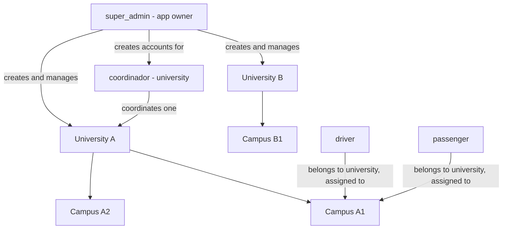
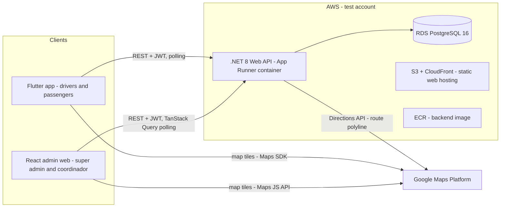
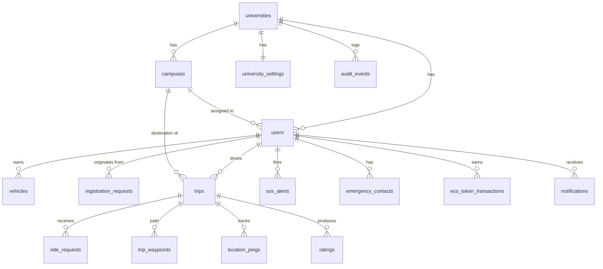
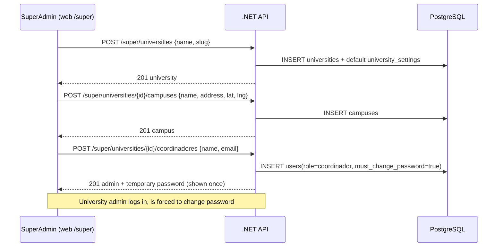
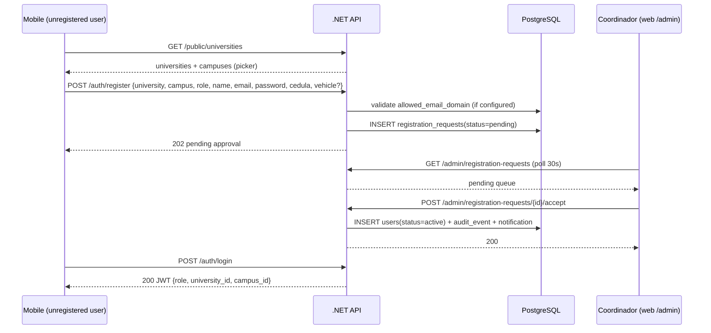
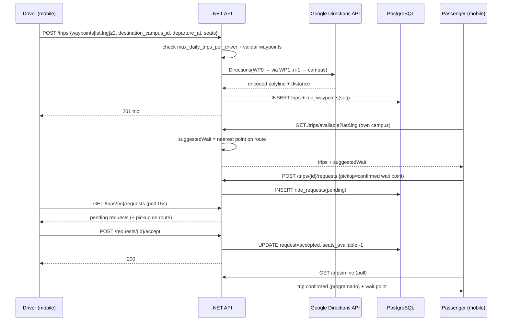
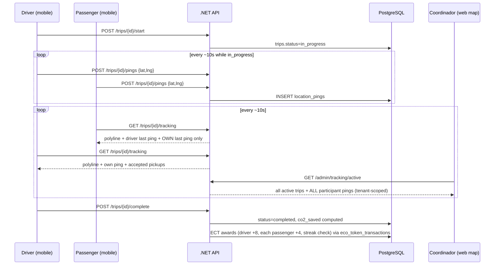
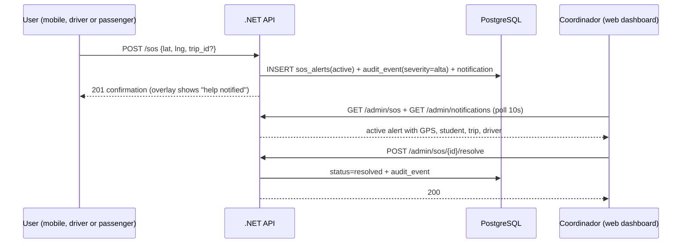

# Kubix UTN — Plan de la plataforma Smart Carpool Security

Versión: 2.9 (seguimiento en `scheduled`, puntos de abordaje del conductor, Maps iOS/web, preview de ruta)
Estado: Auditado. v2.1–2.4 como antes. **v2.5–2.6:** Planner T1–T7. **v2.7–2.8:** T8 (KBX-32·33) waypoints + espera. **v2.9:** cierre de huecos de mapa/tracking sin nueva tarea Planner — pings/poll en `scheduled`, puntos de abordaje visibles al conductor (mismo color que el pasajero), `POST /trips/preview-route`, sync Maps iOS/web, picker de campus en super admin.
Workspace: `/Users/patriciochachalo/jer/fern/smart-carpool-security`

---

## 1. Overview

Kubix UTN es una plataforma multi-tenant de seguridad para carpooling inteligente orientada a universidades. Los estudiantes comparten viajes al campus; la plataforma añade una capa de seguridad: identidades verificadas, alertas SOS, tracking GPS en vivo de viajes activos y auditabilidad completa para coordinadores.

La plataforma aloja **muchas universidades**. Cada universidad tiene **muchos campuses**. Cada driver y passenger pertenece a exactamente una universidad y está asignado a un campus. Un **super admin** (dueño de la app) provisiona instancias de universidad y sus administradores.

| Deliverable | Stack |
|---|---|
| `backend/` | C# .NET 8 Web API, EF Core, PostgreSQL |
| `web/` | React 18 + TypeScript, Vite, TanStack Query, Tailwind + shadcn/ui |
| `mobile/` | Flutter 3.x (pasajeros y conductores) |
| `qa/` | Postman, JMeter, Selenium, TestLink, MantisBT docs |
| `deploy/` | docker-compose (local), AWS + GitHub Actions (cloud) |

Diseños fuente (para copiar/adaptar — ambos son exports de Figma Make que viven junto a este repo):

- Mobile: `../Alta fidelidad Smart Carpool/src/app/App.tsx` — roles passenger + driver, 4 tabs cada uno (Inicio, Mis Viajes, Perfil, Ayuda), overlay SOS, bottom sheet de publicar ruta. Paleta: UTN blue `#003087`, emergency `#C8102E`, eco green `#2E7D32`, gold `#F9A825`, background `#F0F4FA`, font Inter.
- Admin web: `../High-Fidelity  Super Admin Dashboard Wireframe/src/app/App.tsx` — 5 pantallas (Panel de Control, Gestión de Usuarios, Reportes de Viajes, Auditoría de Seguridad, Configuración), búsqueda global, centro de notificaciones, menú de perfil. Sidebar navy oscuro `#0F172A`, primary `#1D4ED8`, fonts Inter + DM Mono. Sus shapes de mock data (`usersData`, `tripsData`, `sosAlerts`, `auditLog`, `initialRequests`, `periodMeta`) definen los contratos de respuesta de la API.

---

## 2. Roles y tenancy

La plataforma tiene exactamente **cuatro roles**. Un usuario tiene un rol (quien quiera ser driver y passenger a la vez necesita dos cuentas — simplificación aceptada en v1). No hay rol de guardia de seguridad en v1: las alertas SOS las maneja el coordinador.

| Role | Scope | Client | Cómo se crea la cuenta |
|---|---|---|---|
| `super_admin` | Global (todos los tenants) | Web `/super/*` | Seedeado en deploy desde credenciales de env (exactamente uno en v1) |
| `coordinador` | Una universidad (todos sus campuses) | Web `/admin/*` | Creado por super_admin con password temporal de un solo uso + cambio forzado |
| `driver` | Su universidad + campus | Mobile | Auto-registro (con datos del vehículo) → el coordinador aprueba |
| `passenger` | Su universidad + campus | Mobile | Auto-registro → el coordinador aprueba |

Matriz de permisos (aplicada por authorization policies + filtros de tenancy; consumida por KBX-4):

| Capability | super_admin | coordinador | driver | passenger |
|---|---|---|---|---|
| CRUD universities / campuses / coordinador accounts | Yes | No | No | No |
| Global platform stats (`/super/stats`) | Yes | No | No | No |
| Approve/deny registrations, block/unblock users | No (out of tenant ops) | Yes (own university) | No | No |
| Dashboard, reports + export, audit log, settings | No | Yes (own university) | No | No |
| Resolve SOS alerts | No | Yes (own university) | Own alerts only (close) | Own alerts only (close) |
| Live tracking map (all trips) | No (v1 — no cross-tenant tracking screen) | Yes (own university) | Own trip, scoped view | Own trip, scoped view |
| Publish / start / complete / cancel trips | No | No | Yes | No |
| Accept/reject ride requests, manage vehicle | No | No | Yes | No |
| Browse available trips, request/cancel rides | No | No | No | Yes (own campus) |
| Rate after trip | No | No | Yes (passengers, ≤12 h) | Yes (driver) |
| Fire SOS | No | No | Yes | Yes |
| Earn EcoTokens | No | No | Yes | Yes |
| Profile + emergency contacts | No | No | Yes | Yes |

Reglas de tenancy:

- Una sola base de datos, schema compartido. Toda tabla con scope de tenant lleva una columna `university_id` — incluidas las tablas hijas (`ride_requests`, `ratings`, `location_pings`, `vehicles`, `emergency_contacts`), donde se desnormaliza del padre (`trips`/`users`) al insertar para que los query filters de EF se apliquen de forma uniforme a cada tabla.
- Claims JWT: `sub`, `role`, `university_id` (null para super_admin), `campus_id` (null para super_admin y coordinador).
- **Global query filters** de EF Core sobre un `ITenantContext` (poblado desde el JWT por request) imponen el aislamiento en cada tabla de tenant. Las requests de `super_admin` omiten los filtros vía un path explícito de policy `IgnoreQueryFilters`.
- Sin dominio de email hardcodeado. Cada universidad puede opcionalmente definir `allowed_email_domain` en su settings; cuando está definido, los registros se validan contra él.
- Los passengers solo ven trips cuyo campus de destino iguala su campus asignado (regla v1; el browsing mismo-universidad otro-campus queda fuera de alcance).

Modelo de tokens de auth:

- Access token: JWT, expiración 60 min, claims anteriores.
- Refresh token: valor opaco aleatorio, almacenado hasheado en `refresh_tokens` (user_id, token_hash, expires_at 14 días, revoked_at), rotado en cada `POST /auth/refresh`. Mobile refresca de forma proactiva para que los viajes largos nunca pierdan capacidad de ping.
- Revocación: el middleware de auth hace un chequeo por request (una query indexada, caché 30 s) de que el `status = active` del usuario y la universidad no está suspended. Eso es lo que hace implementable "bloquear a mitad de sesión → siguiente call 403" y "suspender universidad → usuarios bloqueados". Bloquear/suspender también revoca los refresh tokens del usuario.

Nota sobre el export de Figma: el export del dashboard admin se titula "Super Admin Dashboard" y su persona del sidebar dice "Super Admin", pero en esta plataforma esas cinco pantallas pertenecen al rol **coordinador** (scope de tenant). La consola verdadera de super_admin (`/super/*`) es nueva y no está en Figma. La impersonación read-only de tenants por super_admin queda fuera de alcance en v1 (sección 11).

---

## 3. Architecture

- **Backend**: .NET 8 Web API, capas `Api / Application / Domain / Infrastructure`, EF Core + Npgsql, JWT bearer auth, Swagger/OpenAPI, Serilog. Google Directions API se llama **server-side** al publicar el trip (la key nunca se embarca en el bundle web; mobile igual necesita una key de Maps SDK para tiles, restringida por app id).
- **Web**: Vite + React 18 + TS, React Router (rutas `/login`, `/super/*`, `/admin/*`), TanStack Query para todos los datos (polling vía `refetchInterval` donde se necesitan datos en vivo: SOS 10s, tracking 10s, notifications 30s, cola de registros 30s), Tailwind v4 + los componentes shadcn ya scaffolded en el export de Figma. Cada `*Screen` de Figma se extrae a su propio archivo de ruta.
- **Polling mobile**: trips disponibles 30s, cola de requests del driver 15s, status del trip (`/trips/mine`) 15s mientras un trip está upcoming/active, tracking 10s, pings 10s.
- **Mobile**: Flutter 3.x, Riverpod (state), `dio` (HTTP + interceptor JWT), `google_maps_flutter`, `geolocator`, `flutter_secure_storage` (token). El rol se decide en el login; shell de 4 tabs específico por rol que espeja el diseño.
- **Tiempo real**: polling en todas partes (decisión confirmada). Sin websockets en v1.

---

## 4. Modelo de dominio (PostgreSQL)

| Table | Columnas clave (además de id, timestamps) |
|---|---|
| `universities` | name, slug, status (active/suspended) |
| `campuses` | university_id, name, address, lat, lng |
| `university_settings` | university_id, allowed_email_domain (nullable), timezone, support_email, max_daily_trips_per_driver (default 6), min_driver_rating (default 3.5), co2_factor_kg_km (default 0.21), gamification_enabled (default true), co2_tracking_enabled, notify_sos, notify_block, notify_weekly_report |
| `users` | university_id (null for super_admin), campus_id (null for super_admin and coordinador), role (super_admin/coordinador/driver/passenger), status (active/blocked/pending), name, email (unique per university), password_hash (BCrypt), career, id_number (cedula), rating_avg, eco_balance (default 0), eco_lifetime (default 0), must_change_password |
| `refresh_tokens` | user_id, token_hash, expires_at, revoked_at (nullable) |
| `registration_requests` | university_id, campus_id, name, email, password_hash, role (driver/passenger), career, id_number, vehicle_json (drivers), status (pending/accepted/denied), decided_by, decided_at |
| `vehicles` | university_id, user_id, make_model, plate, color, seats_total |
| `trips` | university_id, driver_id, destination_campus_id, origin_text, origin_lat, origin_lng, departure_at, seats_available, polyline (Google-encoded, nullable — ver política de fallo de Directions), distance_km, status (scheduled/in_progress/completed/cancelled), started_at, completed_at, co2_saved_kg. **v2.7:** `origin_*` = primer waypoint (inicio de ruta); la geometría completa vive en `trip_waypoints` + `polyline` |
| `trip_waypoints` | **(v2.7)** university_id, trip_id, seq (0..n-1 ordenados), lat, lng, label (nullable). Mín. 2 puntos (inicio + al menos un punto de paso). El destino campus **no** se duplica como waypoint: Directions usa waypoints intermedios y destination = campus. Unique(trip_id, seq) |
| `ride_requests` | university_id, trip_id, passenger_id, pickup_text, pickup_lat, pickup_lng, status (pending/accepted/rejected/cancelled_by_passenger/cancelled_by_driver). **v2.7:** el pickup es el punto de espera sobre la ruta (sugerido por el server a partir de la ubicación del passenger; el passenger puede confirmar o ajustar ligeramente). Campos opcionales: `suggested_lat`, `suggested_lng`, `distance_to_route_m` (auditoría / UI) |
| `ratings` | university_id, trip_id, rater_id, rated_id, stars (1–5), comment |
| `sos_alerts` | university_id, trip_id (nullable), user_id, lat, lng, fired_at, status (active/resolved), resolved_by, resolved_at |
| `location_pings` | university_id, trip_id, user_id, lat, lng, recorded_at |
| `audit_events` | university_id (null = nivel plataforma; eventos null-tenant son solo escritura en v1 — ninguna pantalla los lee, se mantienen para forensics a nivel DB), user_id, action, type (sos/auth/admin/system), severity (high/medium/low — renderizados como alta/media/baja), ip, device |
| `notifications` | university_id, recipient_user_id (nullable), recipient_role (nullable — exactamente uno de los dos está set), type (sos/block/auth/report/system), title, body, read (las notificaciones dirigidas por rol comparten un flag read entre los coordinadores de una universidad — simplificación aceptada en v1) |
| `emergency_contacts` | university_id, user_id, name, relationship, phone |
| `eco_token_transactions` | university_id, user_id, type (trip_completed_driver/trip_completed_passenger/rating_submitted/weekly_streak/late_cancel_penalty), amount, source_id (trip_id para tipos trip/penalty, rating_id para ratings, week-key ISO year-week como `2026-W28` para weekly_streak — así unique(user_id, type, source_id) impone idempotencia para cada tipo, incluida la racha una-vez-por-semana bajo concurrencia), created_at |

`university_id` en tablas hijas se desnormaliza al insertar desde el agregado padre para que los query filters de tenancy se apliquen a cada tabla sin joins.

Retención: las filas de `location_pings` se eliminan 7 días después de que su trip alcanza un status terminal (job diario en background, parte del ticket de tracking); se conserva el último ping por usuario por trip para auditoría.

Reglas de negocio mantenidas en v1 (todas aplicadas server-side):
- Cancelación gratuita hasta 30 min antes de la salida; cancelaciones posteriores se marcan en el audit log.
- Cascade al cancelar el driver: cancelar un trip `scheduled` mueve todos los ride_requests pending/accepted a `cancelled_by_driver`; los passengers lo observan en su siguiente poll de `GET /trips/mine`. Cancelar un trip `in_progress` se rechaza con 409.
- Cancelación del passenger de un request accepted restaura `seats_available +1`; los requests previamente auto-rechazados NO se reactivan.
- Ratings: el passenger califica al driver en cualquier momento tras la completion (sin ventana); el driver califica a passengers dentro de 12 h de la completion.
- Enforcement de `min_driver_rating`: cuando el recompute de `rating_avg` de un driver cae por debajo del umbral de la universidad (y tiene ≥5 ratings), el driver pasa automáticamente a `blocked` con un audit event y notificación admin.
- CO2 = distance_km × co2_factor (0 cuando co2_tracking_enabled está off).
- Convención de enums: todos los statuses/enums están **en inglés en DB y API** (`scheduled/in_progress/completed/cancelled`, `system`, `high/medium/low`); los clients renderizan **labels en español** (`programado/en_curso/completado/cancelado`, `sistema`, `alta/media/baja`) como se ve en los diseños. Única excepción documentada: el query param de reporte `period` conserva los valores en español `diario|semanal|mensual|trimestral|anual` porque son vocabulario orientado al diseño.
- `GET /trips/mine` incluye trips donde el request del passenger sigue `pending` (renderizado como "pendiente"); la card "próximo viaje" de PaxHome usa el primer trip upcoming **accepted**, y el poll de status del trip a 15s corre cuando exista cualquier trip upcoming pending o accepted.
- **(v2.7) Ruta del conductor por waypoints:** el driver define la trayectoria con puntos ordenados en el mapa (no un único origin textual). Los waypoints **describen la ruta**; el destino sigue siendo el campus. El passenger puede solicitar el viaje estando en cualquier lugar cercano a esa ruta; el server calcula el **punto de espera sugerido** (proyección al segmento más cercano de la polilínea/waypoints) y se lo muestra. El passenger confirma (o ajusta levemente) ese punto al crear el `ride_request`.

Los emergency contacts son **solo informativos** en v1: se almacenan y se muestran a los coordinadores durante el manejo de SOS, pero no se notifican automáticamente (el copy mobile de SOS debe decir "seguridad del campus notificada", no que se contactó a los contactos).

### EcoTokens (ECT) — reglas de gamificación

Los EcoTokens son **funcionales** en v1 (rediseñados desde solo-estáticos). Todo el accrual es server-side, basado en ledger (`eco_token_transactions`) e idempotente — la unique key (user_id, type, source_id) hace que los replays sean no-ops. `users.eco_balance` y `users.eco_lifetime` están desnormalizados y se actualizan en la misma transacción que el insert del ledger.

Reglas de earning (valores tomados del mock data y FAQ del diseño mobile):

| Event | Who earns | Amount | Trigger |
|---|---|---|---|
| Trip completed | Driver | +8 ECT | `POST /trips/{id}/complete` |
| Trip completed | Each accepted passenger | +4 ECT | Same event |
| Rating submitted | The rater (driver or passenger) | +2 ECT | `POST /trips/{id}/ratings` |
| Weekly streak | Driver or passenger | +10 ECT | 5th completed trip within a Mon–Sun week (max once per user per week) |
| Late cancellation (driver, <30 min before departure) | Driver | −5 ECT (clamped) | `POST /trips/{id}/cancel` flagged late; ledger records the clamped amount −min(5, current balance) so `eco_balance` always equals the ledger sum and never goes below 0; `eco_lifetime` unaffected |

Los niveles se calculan a partir de `eco_lifetime` (nunca disminuye), coincidiendo con los badges del diseño:

| Level | eco_lifetime |
|---|---|
| Bronce | 0–99 |
| Plata | 100–499 |
| Oro | 500–1,999 |
| Platino | 2,000+ |

Reglas adicionales:
- **Ventanas de tiempo:** todos los límites de día/semana ECT (semana de racha lun–dom, "semana actual" del dashboard, "ECT hoy" del driver) se calculan en `university_settings.timezone`; los trips se agrupan en un día/semana por `completed_at`. El `source_id` del ledger de la racha es la week-key ISO year-week en ese timezone.
- **Fuente del conteo de racha:** el conteo de 5 trips es sobre filas del **ledger** `trip_completed_*` en la semana (no la tabla `trips`), de modo que los trips completados con gamificación off nunca cuentan hacia una racha.
- `university_settings.gamification_enabled = false` (default true) → sin accrual para los usuarios de esa universidad; mobile oculta los widgets ECT y el widget XP del admin muestra un estado disabled. `GET /me/eco` sigue funcionando cuando está off, devolviendo el balance congelado más `gamificationEnabled: false` — este flag es cómo mobile sabe ocultar los widgets.
- **Math de progreso de nivel:** `progress = (eco_lifetime − level_floor) / (next_level_floor − level_floor)`; en Platino, `progress = null` (los clients renderizan el badge sin barra de progreso).
- `xpByCareer` suma **solo montos positivos** (earnings, no penalties) de la semana actual, agrupados por `users.career`.
- **El canje está fuera de alcance en v1**: los balances acumulan pero no se pueden gastar; el copy de canje cafetería/librería del diseño se muestra como "próximamente".
- El widget del dashboard admin "Puntos por Carrera · semana actual" es **datos reales** (reemplaza la decisión anterior de estático en el client).
- Los clients leen todo desde `GET /me/eco`: balance, lifetime, level, progress al siguiente nivel, `gamificationEnabled` y transacciones recientes (paginadas) — esto alimenta el EcoWidget mobile, el historial "ECT hoy" del driver y la sección de gamificación del perfil.

---

## 5. Superficie de API (REST, `/api/v1`)

| Group | Endpoints |
|---|---|
| Public | `POST /auth/login` · `POST /auth/refresh` (rotates refresh token) · `POST /auth/register` (creates registration_request) · `GET /public/universities` (id, name, campuses — for the registration picker) |
| Auth | `POST /auth/change-password` · `POST /auth/logout` (revokes refresh token) · `GET /me` |
| Super admin | `GET/POST/PUT /super/universities` · `POST /super/universities/{id}/suspend` · `GET/POST/PUT/DELETE /super/universities/{id}/campuses` · `GET/POST /super/universities/{id}/coordinadores` · `POST /super/coordinadores/{id}/reset-password` · `GET /super/stats` |
| Admin: users | `GET /admin/registration-requests` · `POST /admin/registration-requests/{id}/accept|deny` · `GET /admin/users` (filters: status, role, campus, search) · `POST /admin/users/{id}/block|unblock` · `GET /admin/users/export` |
| Admin: ops | `GET /admin/dashboard` (KPI cards + active SOS list) · `GET /admin/reports?period=` · `GET /admin/reports/export?format=csv|xlsx|pdf` · `GET /admin/audit-log` · `GET /admin/notifications` · `PUT /admin/notifications/{id}/read` · `PUT /admin/notifications/read-all` · `GET/PUT /admin/settings` · `GET /admin/tracking/active` · `GET /admin/sos` · `POST /admin/sos/{id}/resolve` |
| Trips (mobile) | `POST /trips` (publish; **v2.7:** body con `waypoints[]` ordenados + campus + time + seats; backend Directions origin=WP0, via=WP1..n-1, dest=campus; persiste `trip_waypoints` + polyline) · `POST /trips/preview-route` (**v2.9:** Directions sin persistir, para preview en publish) · `GET /trips/available?lat=&lng=` (passenger: scheduled, own campus, seats>0; **v2.7:** si lat/lng presentes, cada ítem incluye `suggestedWait` {lat,lng,distanceM,segmentIndex}) · `GET /trips/{id}/suggested-pickup?lat=&lng=` (recalcular punto de espera) · `GET /trips/mine` · `POST /trips/{id}/start|complete|cancel` · `POST /trips/{id}/requests` (pickup = punto de espera confirmado; **v2.9:** re-solicitud tras reject/cancel reutiliza fila → pending) · `GET /trips/{id}/requests` · `POST /requests/{id}/accept|reject|cancel` |
| Tracking | `POST /trips/{id}/pings` · `GET /trips/{id}/tracking` (visibility-scoped) |
| Ratings | `POST /trips/{id}/ratings` · `GET /ratings/pending` |
| EcoTokens | `GET /me/eco` (balance, lifetime, level, progress, `gamificationEnabled`, recent transactions — paginated; works with frozen balance when gamification is off) |
| SOS | `POST /sos` (lat/lng, optional trip_id) · `POST /sos/{id}/close` (owner marks "estoy a salvo"; alert stays in admin history as resolved with resolver = owner) |
| Profile | `GET/PUT /me/profile` · `GET/POST/DELETE /me/emergency-contacts` · `GET/PUT /me/vehicle` |

Contrato de errores: RFC 7807 problem+json. Paginación: `?page=&pageSize=` con `X-Total-Count`.

Notas:
- El widget XP-by-career del dashboard es **datos reales**: `GET /admin/dashboard` incluye `xpByCareer` (sumas ECT de la semana actual agrupadas por career, desde `eco_token_transactions`).
- Mobile **no tiene feed de notificaciones** en v1: passengers/drivers observan cambios de estado exclusivamente a través de sus polls existentes (`/trips/mine`, `/trips/available`, `/trips/{id}/requests`, `/trips/{id}/tracking`). El icono de campana del header del diseño se omite en mobile.
- Política de fallo de Google Directions: si Directions falla al publicar (timeout, quota, `ZERO_RESULTS`, origin inválido), `POST /trips` igual tiene éxito — el trip se guarda con `polyline = null` y `distance_km` calculado como línea recta haversine **a través de los waypoints en orden + campus**. Las superficies de mapa renderizan segmentos discontinuos entre waypoints→campus cuando `polyline` es null. Se devuelve 422 solo cuando las coordenadas de algún waypoint son inválidas o hay < 2 waypoints.
- **(v2.7) Algoritmo de punto de espera (server-side):** dada la ubicación del passenger y la geometría del trip (polyline si existe; si no, segmentos rectos entre waypoints + campus), proyectar el punto del passenger sobre cada segmento, elegir la proyección con menor distancia haversine. Si la distancia al segmento más cercano supera un umbral configurable (default **800 m**), el trip sigue listable pero `suggestedWait.tooFar = true` (UI avisa; el passenger puede igual solicitar). No se requiere que el passenger esté exactamente en un waypoint: cualquier punto sobre la ruta es válido.
- CORS: la API permite los origins web (localhost:5173 y el dominio CloudFront) vía configuración.

---

## 6. Diagramas de secuencia

### 6.1 Provisioning de universidad (super admin)

### 6.2 Registro y aprobación

### 6.3 Publicar trip (mapa + waypoints), solicitar y aceptar ride

**UX conductor (reemplaza el bottom sheet textual de Figma como flujo principal):**
1. FAB **Agregar ruta** → pantalla de mapa a pantalla completa centrada en GPS actual (recenter disponible).
2. El driver puede mover el mapa / long-press o tap para **añadir waypoints** ordenados (inicio = primer punto; siguientes = por dónde pasará). Reordenar/eliminar puntos; máx. **8** waypoints.
3. Selector de campus destino, hora, asientos → confirmar → `POST /trips` con `waypoints[]`.

**UX pasajero:**
1. `GET /trips/available?lat=&lng=` muestra viajes y, por cada uno, **dónde esperar** (`suggestedWait`).
2. Al solicitar, el mapa muestra la ruta del conductor + marker “espera aquí”; el passenger confirma o mueve ligeramente el pin (snap a la ruta en server).
3. El driver, al aceptar, ve el pickup del passenger sobre su ruta.

### 6.4 Tracking en vivo del trip

Matriz de visibilidad (aplicada server-side en `GET /trips/{id}/tracking`): el passenger ve ruta + ubicación del driver + propia ubicación (nunca otros passengers) + su punto de abordaje; el driver ve ruta + propia ubicación + ubicación en vivo de passengers accepted/pending **y** el punto de abordaje de cada uno (mismo color en UI); el coordinador ve cada participante de cada trip activo en su universidad. Tracking/pings permitidos en `scheduled` e `in_progress` (abordaje previo al start). Super_admin no tiene vista de tracking en v1 (sin endpoint ni pantalla de tracking cross-tenant — coherente con que la impersonación está fuera de alcance).

### 6.5 Alerta SOS

---

## 7. Inventario de pantallas

### Web — consola super admin `/super/*` (nueva; reutiliza shell admin + design system)
| Route | Screen | Content |
|---|---|---|
| `/super/universities` | Universities | Table (name, campuses count, users, status), create/edit/suspend |
| `/super/universities/:id` | University detail | Campuses CRUD, coordinador accounts list + create + reset password |
| `/super/stats` | Platform overview | KPI cards: universities, total users, trips today, active SOS across tenants |

### Web — Consola Coordinador `/admin/*` (desde export de Figma, scope de tenant)
| Route | Figma screen | Adaptation |
|---|---|---|
| `/admin/dashboard` | Panel de Control | KPI cards, SOS monitoring table (poll 10s), XP-by-career widget (real ECT data, current week) |
| `/admin/users` | Gestión de Usuarios | Registration queue (accept/deny), directory with campus filter added, block/unblock, CSV export |
| `/admin/reports` | Reportes de Viajes | Period KPIs, trips table, weekly chart, export CSV/XLSX/PDF |
| `/admin/security` | Auditoría de Seguridad | Summary KPIs, audit log with severity filter + export |
| `/admin/settings` | Configuración | General + allowed email domain + registration rules + toggles (persisted) |
| `/admin/tracking` | (new) | Google Map with all active trips of the university |

### Mobile (desde export de Figma)
| Screen | Source | Adaptation |
|---|---|---|
| Login / Register | (new, follows design language) | University + campus pickers, role choice, driver vehicle fields |
| Passenger: Inicio, Mis Viajes, Perfil, Ayuda | `PaxHome/PaxTrips/PaxProfile/PaxHelp` | Real data incl. EcoTokens balance/level/transactions from `GET /me/eco`; CO2 stats real from trip history; redemption copy shown as "próximamente"; header bell icon omitted (no mobile notifications feed); Ayuda shows support email only (no chat) |
| Driver: Inicio, Mis Viajes, Perfil, Ayuda | `DrvHome/DrvTrips/DrvProfile/DrvHelp` | Real requests accept/reject; **v2.7:** FAB abre mapa de waypoints (no solo PublishModal textual); vehicle from profile; "ECT hoy" from `GET /me/eco` |
| Publish route (mapa) | `PublishRouteMap` (reemplaza `PublishModal` como flujo principal) | GPS + waypoints editables + campus + time + seats → `POST /trips` |
| Passenger: request + punto de espera | `PaxHome` / request sheet | Ruta del driver + `suggestedWait`; confirmar/ajustar pickup |
| SOS overlay | `SOSOverlay` | Wired to `POST /sos` with GPS |
| Trip map (new) | — | google_maps_flutter: polyline + markers per visibility rules, 10s polling |

---

## 8. Deployment

Local (prioridad — todo debe correr en local):
- Root `docker-compose.yml`: `postgres:16` (+ volume, seed), `backend` (Dockerfile, hot-reload opcional), `pgadmin` (opcional).
- `web`: `npm run dev` (Vite, `VITE_API_URL=http://localhost:8080`).
- `mobile`: `flutter run --dart-define=API_URL=http://10.0.2.2:8080` (emulador Android) / localhost (iOS sim).
- `.env.example` en la raíz + por app; credenciales de super admin seedeadas vía env; keys de Google Maps vía env/dart-define.

Cloud (AWS, cuenta de prueba, todo friendly con free-tier):
- Imagen backend → ECR → **App Runner** (sin gestión de cluster). Las migraciones EF Core corren automáticamente al arrancar el contenedor (`Database.Migrate()` gated por un flag de env), así no hace falta acceso VPC desde CI para migrar la instancia RDS privada.
- **RDS PostgreSQL** `db.t4g.micro`.
- Build web → **S3 + CloudFront**.
- Mobile: artefacto APK debug/release desde CI (sin publicación en store).
- CI/CD: **GitHub Actions** — en PR: build + unit tests + lint + Sonar + Newman; en main: push image, deploy App Runner, sync S3, invalidate CloudFront.

---

## 9. Suite de testing y herramientas de QA (herramientas mandatorias)

| Concern | Tool | Qué construimos |
|---|---|---|
| Unit tests BE | xUnit + Moq + Testcontainers (Postgres) | Tests de domain/application + integration tests por grupo de endpoints; coverage gate 70% |
| Unit tests web | Vitest + React Testing Library | Hooks (TanStack Query con msw), components, route guards |
| Unit tests mobile | flutter_test + mocktail | Providers, repositories, widget tests por pantalla |
| Service tests + BE load | Postman (`qa/postman/`) | Colección completa con env files (local/aws), test scripts por request; Newman en CI; perfil de performance Collection Runner (iterations ramped) como el load test Postman requerido |
| Performance | JMeter (`qa/jmeter/kubix.jmx`) | Thread groups para login, available trips, request ride, ping burst (100 users / 10s ramp), assertions sobre p95 |
| Functional automation | Selenium (`qa/selenium/`, Python + pytest) | Flujos admin web: login, approve registration, block user, resolve SOS, export report, super admin creates university. La pantalla de tracking Google Maps se excluye de Selenium (propensa a flakes, necesita key en CI); se cubre con casos manuales TestLink |
| Code analysis | SonarQube → SonarCloud | 3 proyectos (backend, web, mobile) cableados a CI, quality gate en PRs |
| Security / SAST | Semgrep + Sonar security rules + `dotnet list package --vulnerable`, `npm audit`, `dart pub audit` | Job CI `security-scan` |
| Test management | TestLink (`qa/testlink/`) | Suites de test por módulo, XML importable, matriz de trazabilidad ticket↔test case |
| Defect management | MantisBT (`qa/mantis/`) | Doc de workflow: severities, lifecycle, convención de enlace a tickets. Una instancia local MantisBT corre vía `qa/mantis/docker-compose.yml` para los requisitos del curso de QA (sin instancia hosted) |

---

## 10. Epic y tickets (solo contenido — no crear en Jira)

**Epic — KBX: Kubix UTN Smart Carpool Security Platform**
Plataforma multi-tenant de seguridad para carpooling (super admin → universidades → campuses) con React admin web, .NET 8 API, Flutter mobile, PostgreSQL, tracking en vivo de trips con Google Maps, alertas SOS, tooling completo de QA, deployment AWS.

Cada ítem detallado KBX-* más abajo es **alcance interno / checklist**. En Planner no se crean 31+ tareas KBX: se crean **8 tareas agrupadas** T1–T8 (§10.1).

### 10.1 Agrupación Planner — **todo el proyecto = 2 semanas · 8 tareas**

**Duración total: 2 semanas (Día 1 → Día 14).**  
**Calendario ancla (ajustar en Planner si el Día 1 real cambia):**  
| Día relativo | Fecha |
|---|---|
| D1 | 2026-07-06 (lun) |
| D2 | 2026-07-07 |
| D3 | 2026-07-08 |
| D4 | 2026-07-09 |
| D5 | 2026-07-10 |
| D6 | 2026-07-11 |
| D7 | 2026-07-12 |
| D8 | 2026-07-13 |
| D9 | 2026-07-14 |
| D10 | 2026-07-15 |
| D11 | 2026-07-16 |
| D12 | 2026-07-17 |
| D13 | 2026-07-18 |
| D14 | 2026-07-19 (dom) |

**En Planner: 8 tareas** (T1–T7 fases + **T8** delta de diseño v2.7). Los KBX-* **no** se crean como tareas sueltas: van en **Notas** + checklist junto con el AC.

| # | Título | Prioridad | Inicio | Vencimiento | Track | Estado |
|---|---|---|---|---|---|---|
| **T1** | Fundación — monorepo, DB, auth, tenancy | Urgente | 2026-07-06 | 2026-07-07 | Backend | Hecho |
| **T2** | Backend dominio — universidades, usuarios, viajes | Urgente | 2026-07-07 | 2026-07-10 | Backend | Hecho |
| **T3** | Backend ops — EcoTokens, SOS, tracking, admin API | Importante | 2026-07-10 | 2026-07-12 | Backend | Hecho |
| **T4** | Web admin — consola React completa | Importante | 2026-07-11 | 2026-07-15 | Web | Hecho |
| **T5** | Mobile — Flutter auth, pasajero, conductor, SOS, mapa | Importante | 2026-07-13 | 2026-07-17 | Mobile | Hecho |
| **T8** | Ruta por waypoints — mapa conductor + espera pasajero | Importante | 2026-07-13 | 2026-07-17 | Mobile+BE | Hecho |
| **T6** | QA — coverage, Postman/JMeter, Selenium/Sonar/SAST | Importante | 2026-07-15 | 2026-07-18 | QA | Pendiente |
| **T7** | Deploy — AWS + CI/CD | Media | 2026-07-17 | 2026-07-19 | Deploy | Pendiente |

Paralelismo: T8 tras T5 (o solapado al final de T5); T6 tras T8; T7 al cierre.

**Campos por tarea (mapeo Planner):** Título · Prioridad · Fecha de inicio · Fecha de vencimiento · Lista de comprobación (= AC + IDs KBX) · Notas · Datos adjuntos (links/archivos). No pegar las secciones KBX-* largas del PLAN.

---

#### T1 — Fundación — monorepo, DB, auth, tenancy

| Campo Planner | Valor |
|---|---|
| **Título** | Fundación — monorepo, DB, auth, tenancy |
| **Prioridad** | Urgente |
| **Fecha de inicio** | 2026-07-06 (D1) |
| **Fecha de vencimiento** | 2026-07-07 (D2) |

**Lista de comprobación** (pegar como checklist en Planner):
- [x] KBX-1 — Scaffolding monorepo y entorno local
- [x] KBX-2 — Esquema DB, migraciones y seed
- [x] KBX-3 — Auth JWT / refresh / change-password / `/me`
- [x] KBX-4 — Tenancy (filtros + policies)
- [x] `docker compose up` → API healthy `:8080` (Swagger) + Postgres `:55432`
- [x] Migraciones desde cero; seed de arranque solo `super_admin` (creds vía env)
- [x] Login/refresh/logout y change-password; blocked/pending no entran
- [x] Coordinador A no lee datos de universidad B (404)
- [x] README permite reproducir el arranque local

**Notas:**
Dejar el monorepo usable en local: Postgres + API + scaffolds web/mobile, esquema migrado con seed mínimo (`super_admin`), autenticación JWT (login/refresh/logout/change-password/`/me`) y tenancy (filtros + policies). Detalle de implementación: PLAN.md → KBX-1…4. Avance: STATUS.md.

**Datos adjuntos** (agregar en Planner si es posible):
- Link: `README.md` (arranque local)
- Link: `docker-compose.yml` / `docker-compose.dev.yml`
- Link: `.env.example`
- Link: Swagger local `http://localhost:8080/swagger`
- Link: `PLAN.md` §3–4 (stack + esquema)
- Opcional: captura Swagger healthy + `docker compose ps`

---

#### T2 — Backend dominio — universidades, usuarios, viajes

| Campo Planner | Valor |
|---|---|
| **Título** | Backend dominio — universidades, usuarios, viajes |
| **Prioridad** | Urgente |
| **Fecha de inicio** | 2026-07-07 (D2) |
| **Fecha de vencimiento** | 2026-07-10 (D5) |

**Lista de comprobación:**
- [x] KBX-5 — Super admin: universidades, campuses, coordinadores, stats
- [x] KBX-6 — Registro, gestión usuarios, perfil, emergency contacts
- [x] KBX-7 — Vehículos y publicación de viajes
- [x] KBX-8 — Solicitudes de viaje
- [x] KBX-9 — Ciclo de vida / cancelación / historial
- [x] KBX-10 — Ratings + enforcement rating mínimo
- [x] Super admin CRUD + suspend bloquea logins del tenant
- [x] Register → pending → accept/deny; block/unblock; export; perfil + contacts
- [x] Driver publica (Directions o polyline null); passenger available + request
- [x] Accept/reject/cancel respeta seats y reglas de cancelación
- [x] Start/complete/cancel + `GET /trips/mine` + ratings/pending + auto-block

**Notas:**
APIs de negocio core: super admin provisiona universidades/campuses/coordinadores; registro y aprobación de drivers/passengers; publicación de viajes, solicitudes, ciclo start/complete/cancel e historial; ratings con auto-block por rating mínimo. Detalle: PLAN.md → KBX-5…10.

**Datos adjuntos:**
- Link: `PLAN.md` §5 (API surface) y §4 (tablas)
- Link: OpenAPI / Swagger (grupos universities, users, trips)
- Link: commits/PRs de backend dominio
- Opcional: Postman folder “domain” (cuando exista en T6) o capturas de flujos accept/deny

---

#### T3 — Backend ops — EcoTokens, SOS, tracking, admin API

| Campo Planner | Valor |
|---|---|
| **Título** | Backend ops — EcoTokens, SOS, tracking, admin API |
| **Prioridad** | Importante |
| **Fecha de inicio** | 2026-07-10 (D5) |
| **Fecha de vencimiento** | 2026-07-12 (D7) |

**Lista de comprobación:**
- [x] KBX-31 — Motor EcoTokens idempotente + `GET /me/eco`
- [x] KBX-11 — Alertas SOS
- [x] KBX-12 — Tracking / pings
- [x] KBX-13 — APIs operativas de admin
- [x] Completions/ratings acreditan ECT; gamificación off = no-op
- [x] SOS create/close + list/resolve admin; solo tenant
- [x] Pings en `scheduled` e `in_progress`; matriz de visibilidad; admin active trips
- [x] Conductor ve punto de abordaje (pending/accepted) además del ping en vivo (v2.9)
- [x] Dashboard KPIs + SOS + xpByCareer; reportes + export CSV/XLSX/PDF
- [x] Audit log; notifications mark-read; settings GET/PUT

**Notas:**
Motor EcoTokens idempotente, alertas SOS, tracking GPS (pings + visibilidad + retención) y APIs operativas de coordinador (dashboard, reportes/export, auditoría, notificaciones, settings). **Orden:** KBX-31 tras ratings (KBX-10), antes de admin ops (KBX-13). Detalle: PLAN.md → KBX-31, 11–13 · §4 EcoTokens · §6.5 SOS.

**Datos adjuntos:**
- Link: `PLAN.md` §4 (EcoTokens) · §6.5 (secuencia SOS) · §3 (polling)
- Link: endpoints `/sos`, `/admin/sos`, tracking/pings, `/me/eco`
- Opcional: captura dashboard KPIs + alerta SOS activa

---

#### T4 — Web admin — consola React completa

| Campo Planner | Valor |
|---|---|
| **Título** | Web admin — consola React completa |
| **Prioridad** | Importante |
| **Fecha de inicio** | 2026-07-11 (D6) |
| **Fecha de vencimiento** | 2026-07-15 (D10) |

**Lista de comprobación:**
- [x] KBX-14 — Scaffolding web, auth y shell
- [x] KBX-15 — Consola super admin
- [x] KBX-16 — Panel de Control
- [x] KBX-17 — Gestión de Usuarios
- [x] KBX-18 — Reportes de Viajes
- [x] KBX-19 — Auditoría de Seguridad
- [x] KBX-20 — Configuración
- [x] KBX-21 — Mapa de tracking en vivo
- [x] Login/logout/guards; cambio forzado de password; badge notificaciones
- [x] Super: CRUD universidades/campuses/coordinadores + stats
- [x] Campus: picker de mapa (Maps JS) al crear/editar ubicación (v2.9 / KBX-15)
- [x] Panel: KPIs, SOS poll + resolve, XP por carrera
- [x] Usuarios: cola accept/deny, filtros, block, export
- [x] Reportes + export; auditoría; settings dirty-state; mapa poll 10s

**Notas:**
Consola Vite/React con auth y shells por rol; super admin (universidades); coordinador (panel, usuarios, reportes, auditoría, settings, mapa de tracking). Detalle: PLAN.md → KBX-14…21 · §7 rutas web.

**Datos adjuntos:**
- Link: export Figma admin / wireframes (`High-Fidelity Super Admin…`)
- Link: `web/README` o arranque `npm run dev` (:5173)
- Link: `PLAN.md` §7 (rutas `/super/*`, `/admin/*`)
- Opcional: capturas Panel / Usuarios / Tracking / Settings

---

#### T5 — Mobile — Flutter auth, pasajero, conductor, SOS, mapa

| Campo Planner | Valor |
|---|---|
| **Título** | Mobile — Flutter auth, pasajero, conductor, SOS, mapa |
| **Prioridad** | Importante |
| **Fecha de inicio** | 2026-07-13 (D8) |
| **Fecha de vencimiento** | 2026-07-17 (D12) |

**Lista de comprobación:**
- [x] KBX-22 — Scaffolding mobile, auth y registro
- [x] KBX-23 — Flujos de pasajero
- [x] KBX-24 — Flujos de conductor
- [x] KBX-25 — Flujo SOS
- [x] KBX-26 — Mapa de viaje en vivo y pings
- [x] Login + registro wizard + pending; token seguro + refresh
- [x] Pasajero: home, available/request, historial, rating, perfil, ayuda
- [x] Conductor: publish, accept/reject, start/complete, historial, vehículo, ayuda
- [x] SOS overlay con GPS; visible en admin tras poll
- [x] Mapa trip: polyline/fallback, markers (auto/persona/pin), pings 10s en `scheduled` e `in_progress`
- [x] Maps: sync key iOS (`MapsSecrets.xcconfig`) + web (`maps_api_key.js`) vía `tool/sync_maps_key_from_env.sh` (v2.9)

**Notas:**
App Flutter con login/registro (wizard + pending), shells por rol, flujos pasajero y conductor, SOS y mapa en vivo con pings. Copy SOS: “seguridad del campus notificada” (contacts NO se notifican en v1). Map key vía `--dart-define=MAPS_API_KEY=…`. Detalle: PLAN.md → KBX-22…26 · `mobile/README.md`.

**Datos adjuntos:**
- Link: export Figma mobile (`Alta fidelidad Smart Carpool…`)
- Link: `mobile/README.md` (API_URL, MAPS_API_KEY)
- Link: `PLAN.md` §6.5 SOS · §3 polling pings
- Opcional: capturas shells pasajero/conductor, SOS overlay, mapa en vivo
- Opcional: APK/artefacto de build de prueba (si se genera)

---

#### T8 — Ruta por waypoints — mapa conductor + espera pasajero

| Campo Planner | Valor |
|---|---|
| **Título** | Ruta por waypoints — mapa conductor + espera pasajero |
| **Prioridad** | Importante |
| **Fecha de inicio** | 2026-07-13 (D8) |
| **Fecha de vencimiento** | 2026-07-17 (D12) |

**Lista de comprobación:**
- [x] KBX-32 — Backend: `trip_waypoints`, `POST /trips` con waypoints, Directions vias, `suggestedWait`
- [x] KBX-33 — Mobile: mapa publicar ruta (FAB) + espera sugerida al pasajero
- [x] Migración `trip_waypoints` + seed con ≥2 waypoints
- [x] `GET /trips/available?lat=&lng=` y `GET /trips/{id}/suggested-pickup`
- [x] Driver: tap/long-press waypoints (2–8), campus/hora/asientos → publicar
- [x] Pasajero: ve “espera aquí” / tooFar; confirma pickup sobre la ruta
- [x] (v2.9) `POST /trips/preview-route` + preview de polyline al publicar
- [x] (v2.9) Re-solicitud tras reject; mapa conductor con pin de abordaje = color del pasajero
- [x] (v2.9) Squash migración InitialCreate con waypoints/suggested_* / polyline text

**Notas:**
Delta de diseño v2.7–2.9: el conductor dibuja la ruta en el mapa (waypoints); el pasajero puede subir en cualquier punto; el server calcula dónde esperar; el mapa en vivo cubre abordaje en `scheduled`. **No crear T9 en Planner** por el polish v2.9 — actualizar checklist/notas de T8 (+ ítems T3/T5/T4 arriba). Detalle: PLAN.md → KBX-32 · KBX-33 · KBX-26 · §6.3.

**Datos adjuntos:**
- Link: `PLAN.md` §6.3 (secuencia publish + suggestedWait)
- Link: captura mapa publicar (driver) + card “espera aquí” (passenger)
- Link: Swagger `POST /trips`, `GET /trips/available`
- Opcional: video corto de dos dispositivos (driver dibuja / passenger solicita)

#### T6 — QA — coverage, Postman/JMeter, Selenium/Sonar/SAST

| Campo Planner | Valor |
|---|---|
| **Título** | QA — coverage, Postman/JMeter, Selenium/Sonar/SAST |
| **Prioridad** | Importante |
| **Fecha de inicio** | 2026-07-15 (D10) |
| **Fecha de vencimiento** | 2026-07-18 (D13) |

**Lista de comprobación:**
- [x] KBX-27 — Suites unitarias y umbrales de cobertura
- [ ] KBX-28 — Postman, Newman, load y JMeter
- [ ] KBX-29 — Selenium, TestLink, SonarCloud, MantisBT, SAST
- [ ] Coverage gates: BE ≥70% App/Domain, web ≥70% features, mobile ≥60%
- [ ] Postman endpoints clave + Newman verde local; JMeter p95 documentado
- [ ] Selenium headless: login, approve, block, resolve SOS, export, create university
- [ ] TestLink XML importable; Sonar quality gate en PR; Semgrep/audits en CI
- [ ] MantisBT local vía compose documentado

**Notas:**
Cerrar calidad del curso: umbrales de coverage en CI, colección Postman + Newman + JMeter, automatización web Selenium, TestLink, SonarCloud, MantisBT local y SAST. La pantalla de tracking Google Maps se excluye de Selenium (manual TestLink). Detalle: PLAN.md → KBX-27…29 · carpeta `qa/`.

**Datos adjuntos:**
- Link: `qa/README` (cuando exista) · colección Postman · `kubix.jmx`
- Link: reportes de coverage / Newman / JMeter en `qa/results/`
- Link: XML TestLink · `qa/mantis/docker-compose.yml`
- Link: SonarCloud project / badge de quality gate
- Opcional: captura Selenium verde headless + informe Semgrep

---

#### T7 — Deploy — AWS + CI/CD

| Campo Planner | Valor |
|---|---|
| **Título** | Deploy — AWS + CI/CD |
| **Prioridad** | Media |
| **Fecha de inicio** | 2026-07-17 (D12) |
| **Fecha de vencimiento** | 2026-07-19 (D14) |

**Lista de comprobación:**
- [ ] KBX-30 — Infra AWS + pipelines CI/CD
- [ ] API: imagen ECR → App Runner; migraciones al arranque
- [ ] Web: S3 + CloudFront (SPA routing)
- [ ] CI: PR build/test/lint/sonar/newman/security; main deploy + invalidation
- [ ] Smoke Postman env `aws` (o checklist equivalente) verde
- [ ] Script/doc de teardown sin recursos facturables residuales

**Notas:**
Infra de prueba AWS (ECR, App Runner, RDS t4g.micro, S3+CloudFront) y GitHub Actions; documentar deploy y **teardown** para no dejar cargos. Detalle: PLAN.md → KBX-30 · `deploy/README`.

**Datos adjuntos:**
- Link: `deploy/README` (deploy + teardown)
- Link: workflows `.github/workflows/*`
- Link: URLs CloudFront + App Runner (cuando existan)
- Link: Postman environment `aws`
- Opcional: captura smoke verde + evidencia de teardown (cuenta limpia)

---

#### Cómo configurar Planner
1. Plan único: epic **KBX: Kubix UTN…**; **inicio 2026-07-06**, **fin 2026-07-19** (o re-anclar el calendario D1–D14).
2. Crear **8 tareas** con el **Título** exacto de T1–T8 (incluir T8 waypoints).
3. En cada tarea completar: **Prioridad**, **Fecha de inicio**, **Fecha de vencimiento**.
4. Pegar la **Lista de comprobación** (ítems KBX + AC). Marcar hechos según STATUS.
5. Pegar **Notas** (resumen corto; no las secciones KBX-* largas).
6. En **Datos adjuntos**, añadir los links/archivos listados (GitHub raw/blob, Figma, capturas).
7. Marcar la tarea hecha cuando toda la lista de comprobación esté checked.
8. Avance diario: [STATUS.md](STATUS.md). Detalle de implementación: secciones KBX-* más abajo.

#### Notas globales
- Prioridades Planner: **Urgente** / **Importante** / **Media** / **Baja** (UI de Planner en español; en inglés: Urgent / Important / Medium / Low).
- KBX-31 va en **T3** (tras ratings, antes de admin ops).
- Seed de arranque: solo `super_admin`; demo tests = `SembrarDemoAsync`.
- Si el Día 1 real del equipo no es 2026-07-06, desplazar todas las fechas manteniendo la duración D* de cada T.

### KBX-1 — Scaffolding del monorepo y entorno local
**Descripción:** Crear `smart-carpool-security/` con `backend/` (solución .NET 8: Api, Application, Domain, Infrastructure, Tests), `web/` (Vite + React + TS + Tailwind + base shadcn copiada del export de Figma), `mobile/` (app Flutter con Riverpod, dio, flavors), `qa/`, `deploy/`, root `docker-compose.yml` (postgres:16, backend, pgadmin), `.env.example`, README con instrucciones de ejecución.
**QA:** `docker compose up` deja Postgres + API saludables en :8080 con Swagger; `npm run dev` sirve web en :5173; `flutter run` arranca al login en el emulador; los pasos del README son reproducibles desde una máquina limpia.

### KBX-2 — Esquema de base de datos, migraciones y datos seed
**Descripción:** Entidades EF Core + migraciones para todas las tablas de la sección 4, incluyendo `refresh_tokens`, `eco_token_transactions` (con la unique key de idempotencia), `university_id` desnormalizado en todas las tablas hijas, y el set completo de columnas de `university_settings` (timezone, support_email, toggles de notificación, co2_tracking_enabled). Seed: 1 super admin (credenciales vía env), 2 universidades, 2 campuses cada una, 1 coordinador cada una, ~15 drivers/passengers, sample trips/requests/SOS/audit events, y entradas del ledger ECT consistentes con los trips completed seedeados — algunos trips completed y sus filas de ledger fechados relativos a "ahora" (dentro de la semana lun–dom actual) para que el widget XP del dashboard y "ECT hoy" no queden vacíos de fábrica. Los seeds contienen solo trips hacia el campus (return trips fuera de alcance).
**QA:** `dotnet ef database update` desde cero tiene éxito; seeds idempotentes; FKs y unique(email, university_id) forzados; cada tabla de tenant (incluyendo ride_requests, ratings, location_pings, vehicles, emergency_contacts) tiene un `university_id` poblado; los logins seedeados funcionan para los 4 roles.

### KBX-3 — Auth: login, JWT, refresh tokens, revocación, cambio de contraseña
**Descripción:** `POST /auth/login` (email+password, BCrypt) devolviendo un JWT de 60 min (`sub/role/university_id/campus_id`) más un refresh token opaco (hasheado en `refresh_tokens`, expiración 14 días, rotado en `POST /auth/refresh`, revocado en logout/block/suspend). El middleware de auth hace un chequeo por request de user-status + university-status (caché 30 s) para que bloquear o suspender surta efecto a mitad de sesión. `POST /auth/change-password`, cambio forzado cuando `must_change_password`, `GET /me`. Usuarios blocked/pending no pueden iniciar sesión.
**QA:** unit tests de claims del token por rol; el refresh rota (el refresh token viejo se rechaza tras usarlo); usuario blocked obtiene 403 con problem+json en la siguiente call dentro de la ventana de caché de 30 s; suspender universidad bloquea a todos sus usuarios; access token expirado 401 y el client se recupera vía refresh; el flujo must_change_password bloquea otros endpoints hasta el cambio.

### KBX-4 — Infraestructura de tenancy
**Descripción:** Servicio scoped `ITenantContext` poblado desde el JWT; global query filters de EF sobre `university_id` para TODAS las tablas de tenant — incluidas las tablas hijas desnormalizadas (ride_requests, ratings, location_pings, vehicles, emergency_contacts) — más un interceptor de save-changes que estampa `university_id` en los inserts; authorization policies (`SuperAdminOnly`, `CoordinadorOnly`, `DriverOnly`, `PassengerOnly`, `MobileUser`) implementando la matriz de permisos de la sección 2; path de bypass de super_admin; helper de escritura de audit_event.
**QA:** integration tests prueban que el coordinador de la universidad A no puede leer/mutar filas de la universidad B (404, no leak 403) para cada tabla de tenant incluidas las cinco hijas; los inserts reciben `university_id` estampado automáticamente; el super admin lee across tenants; barrido de autorización negativa guiado por la matriz (p. ej. driver llamando `GET /trips/available` o aceptando su propio request como passenger → 403; passenger llamando `POST /trips` o `POST /requests/{id}/accept` → 403; coordinador llamando `POST /trips` → 403); cada mutación admin escribe un audit event.

### KBX-5 — API super admin: universidades, campuses, coordinadores, stats
**Descripción:** CRUD universities (+suspend bloquea los logins de todos sus usuarios), CRUD campuses, crear coordinador (password temporal generado devuelto una sola vez, `must_change_password=true`), reset password de coordinador, `GET /super/stats` (universities, users, trips today, active SOS).
**QA:** suspend university → sus usuarios obtienen 403 en login; el password temporal funciona exactamente el flujo de una vez (login → cambio forzado); las stats agregadas across tenants coinciden con los seeds.

### KBX-6 — API de registro, gestión de usuarios, perfil y contactos de emergencia
**Descripción:** `POST /auth/register` validando existencia de university/campus y `allowed_email_domain` opcional; `GET /admin/registration-requests`; accept (crea usuario active + vehicle para drivers) / deny; `GET /admin/users` con filtros (status, role, campus, text search) + paginación; block/unblock (block también revoca refresh tokens); export CSV. También posee `GET /public/universities` (picker de registro) y los endpoints de perfil mobile: `GET/PUT /me/profile`, `GET/POST/DELETE /me/emergency-contacts` (máx. 3 contactos, formato de teléfono validado).
**QA:** registrar con dominio incorrecto → 422 con mensaje claro; accept crea usuario capaz de iniciar sesión; deny mantiene al usuario incapaz; block a mitad de sesión → calls autenticadas 403 dentro de ≤30 s (ventana de caché del status-check de KBX-3); el export coincide con las filas filtradas; el endpoint público de universities no requiere auth y lista campuses; CRUD de emergency contacts round-trip con tests de tenancy; 4.º contacto → 422.

### KBX-7 — API de vehículos y publicación de viajes
**Descripción:** `GET/PUT /me/vehicle`; `POST /trips` valida rol driver, vehicle active, `max_daily_trips_per_driver`; el backend llama Google Directions, guarda polyline + distance_km. **v2.7:** el contrato canónico pasa a `waypoints[]` (≥2) — ver **KBX-32**; hasta entonces origin único sigue válido como compat (migrado a waypoints mínimos). Política de fallo Directions (sección 5): timeout/quota/ZERO_RESULTS → trip con `polyline = null` + distancia haversine; coords inválidas → 422.
**QA:** publicar sobre límite diario → 422; polyline + distance persistidos (Directions mockeado); fallo Directions → polyline null; origin/waypoint inválido → 422; non-drivers 403.

### KBX-8 — API de solicitudes de viaje
**Descripción:** `GET /trips/available` (campus del passenger, scheduled, seats>0, departure futura); `POST /trips/{id}/requests` con punto de pickup; driver `GET /trips/{id}/requests`; accept/reject/cancel como antes. **v2.7:** available acepta `lat`/`lng` y devuelve `suggestedWait`; ver **KBX-32**.
**QA:** passenger de otro campus no ve el trip; aceptar último asiento auto-rechaza pending; request duplicado → 409; cancel accepted restaura asiento.

### KBX-9 — API de ciclo de vida, cancelación e historial de viajes
**Descripción:** `POST /trips/{id}/start` (driver, scheduled→in_progress), `complete` (calcula co2_saved = distance × factor, 0 si co2 tracking deshabilitado; llama `IEcoTokenEngine` — stub no-op hasta que KBX-31 lo reemplace — para awards de driver/passenger/streak), `POST /trips/{id}/cancel` — posee las reglas completas de cancelación: solo trips `scheduled` cancelables (in_progress → 409); gratis ≥30 min antes de departure, marcado late en audit en caso contrario (late cancel también llama al hook de penalty del engine); el cascade mueve todos los ride_requests pending/accepted a `cancelled_by_driver`. `GET /trips/mine` devolviendo historial apropiado al rol con statuses y stats de periodo (week/month/total: trips, km, co2) coincidiendo con las cajas de stats del diseño mobile — este poll es cómo los passengers observan cancelaciones del driver.
**QA:** transiciones inválidas (complete un trip scheduled, cancel un trip in_progress) → 409; cancel hace cascade a todos los requests y el `/trips/mine` del passenger lo refleja; late cancel escribe audit event; math de stats verificado contra datos seedeados; el historial del passenger muestra solo trips en los que fue accepted.

### KBX-10 — API de ratings y enforcement de rating mínimo
**Descripción:** `POST /trips/{id}/ratings` — passenger califica al driver en cualquier momento tras la completion (sin ventana); driver califica passengers dentro de ventana de 12 h; recompute `users.rating_avg`; llama `IEcoTokenEngine` (stub no-op hasta KBX-31) para award +2 ECT al rater; `GET /ratings/pending` para la card de "rating pendiente". En el recompute, si el avg de un driver cae por debajo del `min_driver_rating` de la universidad con ≥5 ratings, auto-block del driver (status=blocked, audit event, notificación admin).
**QA:** rating del driver fuera de la ventana de 12 h → 422; doble rating mismo trip/persona → 409; avg recompute correcto; la lista pending se vacía tras el rating; driver que cae bajo el umbral con ≥5 ratings queda auto-bloqueado y aparece en notificaciones admin; bajo el umbral con <5 ratings no se bloquea.

### KBX-11 — API de alertas SOS
**Descripción:** `POST /sos` (lat/lng, trip_id opcional) crea alerta active + audit event de high-severity + notificación admin; `POST /sos/{id}/close` (el owner de la alerta marca "estoy a salvo" → resolved, resolver = owner); `GET /admin/sos` listado con student/trip/driver/GPS; `POST /admin/sos/{id}/resolve`.
**QA:** alerta visible para el propio coordinador dentro de un ciclo de poll; otro coordinador no puede verla; close del owner y resolve del coordinador ambos estampan resolver + time; cerrar la alerta de otro → 404; disparar sin trip activo igual funciona.

### KBX-12 — API del servicio de tracking
**Descripción:** `POST /trips/{id}/pings` (solo participantes de un trip in_progress); `GET /trips/{id}/tracking` aplicando la matriz de visibilidad (sección 6.4); `GET /admin/tracking/active` (trips con scope de tenant + últimos pings de todos los participantes). Las queries calientes leen solo el último ping por usuario por trip (indexado). Job de retención en background: borrar pings 7 días después de que el trip alcanza status terminal, conservando el último ping de cada usuario para auditoría.
**QA:** integration tests por rol: la respuesta del passenger excluye pings de otros passengers; ping en trip no active → 409; non-participant → 403; admin ve todos los participantes; el job de retención borra pings viejos pero conserva last-per-user; p95 del tracking GET < 200 ms con 50 trips activos (JMeter después).

### KBX-13 — APIs operativas de admin (dashboard, reportes, auditoría, notificaciones, settings)
**Descripción:** `GET /admin/dashboard` (trips today, blocked users, CO2 saved, adoption rate + lista de SOS activos + sumas ECT de semana actual `xpByCareer` desde el ledger de KBX-31); `GET /admin/reports?period=diario|semanal|mensual|trimestral|anual` + tabla de trips + datos del chart semanal; export CSV/XLSX/PDF (ClosedXML + QuestPDF; fallo de generación → 500 problem+json mostrado como toast); `GET /admin/audit-log` (filtros: type, severity); `GET /admin/notifications` + `PUT /admin/notifications/{id}/read` + `PUT /admin/notifications/read-all`; `GET/PUT /admin/settings` (set completo de columnas incl. timezone, support email, toggles).
**QA:** números KPI reproducibles desde seeds; cada formato de export abre correctamente y coincide con los datos en pantalla; mark-read decrementa el badge no leído; settings persisten y surten efecto (p. ej. cambiar allowed_email_domain afecta el siguiente registro).

### KBX-14 — Scaffolding web, auth y shell de la app
**Descripción:** App Vite con React Router (`/login`, `/super/*`, `/admin/*` guarded por rol), client TanStack Query, axios con interceptor JWT + redirect 401, layout shell copiado del export de Figma (sidebar oscuro, header con search/notifications/profile menu), tokens theme.css, pantalla de cambio forzado de password.
**QA:** Vitest: route guards por rol; round trip login/logout contra API local; poll de notificaciones (30s) renderiza badge no leído; deep link no autorizado → login.

### KBX-15 — Web: consola de super admin
**Descripción:** tabla `/super/universities` + diálogos create/edit/suspend; detalle de universidad con CRUD de campuses y coordinadores (create muestra password temporal una vez, botón copiar); KPI cards `/super/stats`. Mismo lenguaje visual que la consola del coordinador.
**QA:** Selenium: create university → campus → admin → iniciar sesión como ese admin en incógnito tiene éxito; suspend oculta usuarios del tenant del login; tests RTL de validación de forms.

### KBX-16 — Web: Panel de Control
**Descripción:** Portar Figma `DashboardScreen`: 4 KPI cards cableadas a `GET /admin/dashboard`, tabla de monitoreo SOS con polling 10s y acción resolve, widget XP-by-career renderizado desde los datos `xpByCareer` de la API (estado disabled cuando gamificación está off).
**QA:** SOS disparado desde mobile/postman aparece en ≤10s sin refresh; resolve actualiza la fila + audit log; KPI cards coinciden con la API; barras XP coinciden con sumas del ledger seedeado; gamificación off → estado disabled del widget; estados loading/error cubiertos por tests RTL.

### KBX-17 — Web: Gestión de Usuarios
**Descripción:** Portar Figma `UsersScreen`: cola de registration requests (accept/deny con confirm, vista de detalle documento/vehicle del driver), cards de stats, directorio de usuarios (filtros: status/role/campus + search, paginación), block/unblock, export CSV.
**QA:** accept → el usuario aparece en el directorio como activo; deny → se queda fuera; los filtros se combinan correctamente; el export descarga y coincide con el filtro actual; el diálogo de confirm de block evita clicks accidentales.

### KBX-18 — Web: Reportes de Viajes
**Descripción:** Portar Figma `ReportsScreen`: selector de periodo (diario→anual) que alimenta KPI cards, tabla de trips, bar chart semanal, botones de export (CSV/XLSX/PDF) llamando al endpoint de export con manejo de descarga.
**QA:** cambiar periodo refetch y actualiza todos los widgets; patrón de nombre de archivo exportado `kubix_reporte_{period}_{range}`; totales del chart igualan sumas de la tabla para datos seedeados.

### KBX-19 — Web: Auditoría de Seguridad
**Descripción:** Portar Figma `SecurityScreen`: 4 KPI de resumen, tabla de audit log con filtros type/severity y export; enlace desde el panel de notificaciones.
**QA:** acciones admin hechas en otras pantallas (block user, resolve SOS) aparecen en el log; filtro de severity correcto; aislamiento de tenant verificado (sin eventos cross-university).

### KBX-20 — Web: Configuración
**Descripción:** Portar Figma `SettingsScreen` cableado a `GET/PUT /admin/settings`: info general, allowed email domain, reglas de registro (max daily trips, min rating), toggles gamificación/CO2, save/cancel con dirty-state guard.
**QA:** save persiste tras reload; cancel revierte; cambiar el factor co2 cambia los valores co2 de completions de trips posteriores; apagar gamificación detiene el accrual ECT (verificado vía una completion de trip posterior) y el widget XP del dashboard muestra su estado disabled; valores inválidos (negativos, fuera de rango) bloqueados con errores inline.

### KBX-21 — Web: mapa de tracking en vivo
**Descripción:** Nueva pantalla `/admin/tracking`: mapa Google Maps JS mostrando cada trip activo de la universidad — polylines de ruta y markers de participantes (estilos driver vs passenger), polling 10s, panel lateral de lista de trips, click-to-focus, enlaces desde filas SOS.
**QA:** con 2 trips activos concurrentes (seedeados/simulados), ambos renderizan con polylines correctas; un trip null-polyline renderiza una línea recta discontinua; los markers se mueven en el siguiente poll tras nuevos pings; empty state cuando no hay trips activos; key Maps JS inyectada vía env en build time y protegida por restricción HTTP-referrer (las client keys siempre son visibles en el bundle).

### KBX-22 — Scaffolding mobile, auth y registro
**Descripción:** App Flutter: theme desde design tokens (paleta UTN blue, Inter), pantalla de login, wizard de registro (university picker → campus picker → role → datos personales → vehicle si driver) pegando a `/public/universities` + `/auth/register`, pantalla de estado "pending approval", almacenamiento seguro de token, interceptor dio, shell de navegación por rol (4 tabs, estilo FooterNav).
**QA:** widget tests de validación del wizard; register → pantalla pending; tras accept del admin, login aterriza en el shell correcto del rol; el token sobrevive reinicio de la app; fallo de refresh-token (expired/revoked) fuerza re-login con mensaje amigable; dominio incorrecto muestra el mensaje del server.

### KBX-23 — Mobile: flujos de pasajero
**Descripción:** Portar `PaxHome` (card próximo viaje, EcoWidget, lista `/trips/available`, request), `PaxTrips`, `PaxProfile`, `PaxHelp`. **v2.7:** el request usa punto de espera sugerido sobre la ruta del conductor — ver **KBX-33**.
**QA:** request → cola del driver; rating +2 ECT; gamificación off oculta ECT.

### KBX-24 — Mobile: flujos de conductor
**Descripción:** Portar `DrvHome` (card de ruta activa con start/complete, historial "ECT hoy" desde `GET /me/eco`, cards de request accept/reject polling 15s, FAB), `DrvTrips`, `DrvProfile`, `DrvHelp`. **v2.7:** el FAB ya no abre solo el `PublishModal` textual — el flujo canónico es **KBX-33** (mapa + waypoints). El modal textual puede quedar como fallback temporal hasta cerrar KBX-33.
**QA:** publish (waypoints) → passenger del mismo campus lo ve; accept actualiza seats; complete suma +8 ECT; publish sobre límite muestra error amigable.

### KBX-25 — Mobile: flujo SOS
**Descripción:** Portar `SOSOverlay`: confirm fullscreen rojo, captura GPS vía geolocator, `POST /sos` (adjuntando trip activo si hay), estado de éxito mostrando "seguridad del campus notificada" (copy ajustado — los emergency contacts NO se notifican automáticamente en v1), botón "Estoy a salvo" llamando `POST /sos/{id}/close`, disponible desde las pantallas home de ambos roles.
**QA:** alerta disparada aparece en el dashboard admin dentro del ciclo de poll; "estoy a salvo" resuelve la alerta del lado admin; el path de permisos GPS denegados muestra fallback (enviar sin coords bloqueado con mensaje); protección anti double-tap.

### KBX-26 — Mobile: mapa de viaje en vivo y pings
**Descripción:** Pantalla de mapa del trip (google_maps_flutter): polyline de ruta (línea recta discontinua cuando polyline es null), marker del driver (icono auto), marker de passengers (persona) y pin de abordaje **del mismo color** por pasajero; para un trip `scheduled` el mapa muestra ruta + abordaje + ubicaciones en vivo (pings/poll permitidos); loop de ping en foreground cada 10s mientras el trip está `scheduled` o `in_progress`; poll de tracking cada 10s sin flicker (conserva último valor); pings fallidos durante pérdida de red se descartan; auto-stop en complete/cancel. Keys: `--dart-define=MAPS_API_KEY` + sync iOS/web (`tool/sync_maps_key_from_env.sh`); Flutter web requiere Maps JavaScript API en `web/index.html`.
**QA:** dos dispositivos (driver+passenger): el passenger ve moverse el marker del driver, nunca ve un tercer participante; trip scheduled renderiza ruta + pin de abordaje; conductor ve persona + pin del mismo color; los pings se detienen tras complete; map key vía dart-define/sync, restringida por app id / HTTP referrer.

### KBX-27 — QA: suites unitarias y umbrales de cobertura
**Descripción:** Consolidar testing unit/integration: backend xUnit + Testcontainers (coverage ≥70% Application/Domain), web Vitest+RTL+msw (≥70% src/features), mobile flutter_test+mocktail (≥60%). Cablear reportes de coverage en artefactos de CI.
**QA:** CI falla bajo los umbrales; reportes de coverage publicados por PR; política de flaky-test documentada en qa/README.

### KBX-28 — QA: colección Postman, pruebas de carga y plan JMeter
**Descripción:** Colección Postman cubriendo cada endpoint con test scripts (status, schema, casos negativos de tenancy), environments (local/aws); job Newman en CI; perfil de load Postman (Collection Runner: 50 iterations ramped) para el BE según mandato; JMeter `kubix.jmx`: login, available trips, create request, ping burst — 100 threads/10s ramp, assertions p95 (<500 ms API, <200 ms tracking).
**QA:** Newman verde sobre seeds locales; las corridas de load producen artefactos de resultado guardados en `qa/results/`; el plan JMeter abre en GUI y corre headless vía CLI con el comando documentado.

### KBX-29 — QA: Selenium, TestLink, SonarCloud, MantisBT, SAST
**Descripción:** Selenium (Python+pytest, `qa/selenium/`) flujos: admin login, approve registration, block user, resolve SOS, export report, super admin creates university — pantalla de tracking map explícitamente excluida (cubierta por casos manuales TestLink); suites TestLink XML importables + matriz de trazabilidad (`qa/testlink/`); proyectos SonarCloud para los 3 codebases con quality gate en PR; doc de workflow MantisBT + instancia local vía `qa/mantis/docker-compose.yml`; job CI `security-scan` (Semgrep + dependency audits).
**QA:** suite Selenium verde headless en CI contra el stack docker-compose; XML TestLink importa limpio e incluye casos manuales de la pantalla de mapa; quality gates Sonar visibles en PRs; instancia MantisBT arranca en local; security scan falla el build en findings de high-severity.

### KBX-30 — Despliegue: infraestructura AWS y CI/CD
**Descripción:** `deploy/`: servicio ECR + App Runner (env vars desde SSM), RDS Postgres (t4g.micro) con paso de migración, S3+CloudFront para web con routing SPA, workflows GitHub Actions (PR: build/test/sonar/newman/security; main: image push, App Runner deploy, S3 sync + invalidation, artefacto APK). Documentar teardown para evitar cargos en la cuenta de prueba.
**QA:** deploy fresco desde cuenta AWS vacía siguiendo deploy/README tiene éxito; smoke Postman env `aws` verde contra la API desplegada; web carga sobre CloudFront e inicia sesión; el script de teardown no deja recursos facturables.

### KBX-31 — Motor EcoTokens y API (track backend: después de KBX-10, antes de KBX-13)
**Descripción:** Implementación real de `IEcoTokenEngine` reemplazando el stub no-op cableado en KBX-9/10, aplicando las reglas de la sección 4: eventos de award (driver +8 / passenger +4 en trip completion, +2 en rating, +10 racha semanal en el 5.º trip completed en la semana lun–dom del timezone de la universidad, late-cancel penalty registrado como −min(5, balance) clamped); idempotente vía unique(user_id, type, source_id) donde source_id es trip_id / rating_id / week key ISO por tipo — la week key hace la racha una-vez-por-semana incluso bajo completions concurrentes; la racha cuenta solo filas del ledger `trip_completed_*`; `eco_balance`/`eco_lifetime` desnormalizados actualizados en la misma transacción (la suma del ledger siempre iguala eco_balance); cómputo de level + fórmula de progress (null en Platino); no-op cuando `gamification_enabled = false`; `GET /me/eco` (balance, lifetime, level, progress, `gamificationEnabled`, transacciones paginadas); agregación de montos positivos de la semana actual `xpByCareer` consumida por el dashboard de KBX-13. Pese al número, se ejecuta en el track backend: after KBX-10, before KBX-13.
**QA:** completar un trip seedeado acredita exactamente +8/+4 una vez (reproducir el evento es no-op, incluido el tipo penalty); dos completions concurrentes del 5.º trip en la misma semana producen exactamente un +10 (constraint unique week-key); late cancel con balance 2 registra −2 y deja eco_lifetime sin cambios; la suma del ledger iguala eco_balance tras cada escenario; límites de level en 100/500/2000 y fórmula de progress (incl. null en Platino) verificados; ventanas week/day respetan `university_settings.timezone`; universidad con gamificación off no acumula nada, sus trips no cuentan hacia rachas, y `/me/eco` devuelve el balance congelado con `gamificationEnabled: false`; xpByCareer suma solo montos positivos de la semana actual y coincide con seeds.

### KBX-32 — Backend: waypoints de ruta + punto de espera sugerido (v2.7+)
**Descripción:** Migración `trip_waypoints`; `POST /trips` acepta `waypoints[]` (≥2, ≤8) + campus; deriva `origin_*` de WP0; Directions WP0→via→campus; persiste waypoints + polyline (`text`). `POST /trips/preview-route` (v2.9) calcula polyline sin persistir. `GET /trips/available?lat=&lng=` y `GET /trips/{id}/suggested-pickup` calculan proyección al segmento más cercano (umbral tooFar default 800 m); lazy backfill de polyline si faltaba. Extender `ride_requests` con suggested_* / `distance_to_route_m`; re-solicitud tras reject/cancel. Tracking: pings + `GET tracking` en `scheduled`/`in_progress`; conductor recibe `boarding_point` por cada solicitud pending/accepted.
**QA:** publish con 3 waypoints persiste seq 0..2; preview no crea trip; fallo Directions → polyline null pero waypoints intactos; suggestedWait cae sobre segmento; passenger >800 m → tooFar; conductor ve boarding_point + ping del mismo pasajero; tests de tenancy en trip_waypoints; <2 waypoints → 422.

### KBX-33 — Mobile: mapa publicar ruta + espera del pasajero (v2.7+)
**Descripción:** Flujo principal publicar: pantalla mapa (GPS, recenter, tap/long-press waypoints, máx 8), preview Directions debounce, campus/hora/asientos → `POST /trips`. Pasajero: available con GPS; sheet de abordaje con “espera aquí” (`suggestedWait`); al solicitar confirma o ajusta pin (server re-snap); tras reject puede re-solicitar. Conductor: cola de requests con “ver en mapa” → pins de abordaje. Panel de asientos colapsable al focus del teclado.
**QA:** driver dibuja ≥2 puntos, ve preview y publica; passenger ve suggestedWait coherente con su GPS; tooFar muestra aviso; request confirmado aparece en cola driver con pickup en ruta; sin permiso GPS → mensaje y no inventar coords.

---

## 11. Fuera de alcance (v1)

**Canje/redención** de EcoToken (accrual y levels SÍ están en alcance; gastar en cafetería/librería no — se muestra como "próximamente"), pagos reales, chat, pipeline de subida/verificación de documentos, push notifications (el polling cubre v1), feed de notificaciones mobile (el estado se observa vía polls de trips), publicación en store, i18n (la UI permanece en español como está diseñada), websockets, browsing cross-campus campus-a-campus, **return trips que originan desde el campus** (ambos datasets de Figma los muestran; v1 modela solo trips hacia el campus y los seeds no deben contener ninguno), impersonación read-only de tenants por super admin, notificación automática de emergency contacts en SOS (los contactos son informativos solo para coordinadores), rol de guardia de seguridad (SOS manejado por coordinador), usuarios con roles driver y passenger en una sola cuenta.

## 12. Riesgos

| Risk | Mitigation |
|---|---|
| Facturación de Google Maps en cuentas de prueba | Keys restringidas; Directions llamado una vez por publish; fallback de static map documentado |
| Fugas de tenancy | Query filters + integration tests mandatorios por endpoint (gate KBX-4) |
| Carga de polling por pings | Índice last-ping-per-user; JMeter valida; intervalo configurable |
| Los exports de Figma son monolitos | Pantallas reimplementadas por componente usando el export como referencia visual/DOM, no importadas de golpe |
